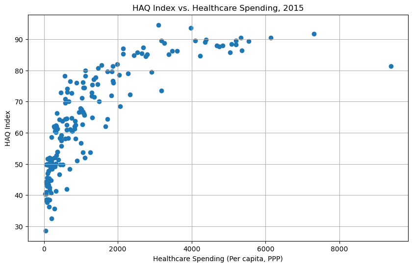
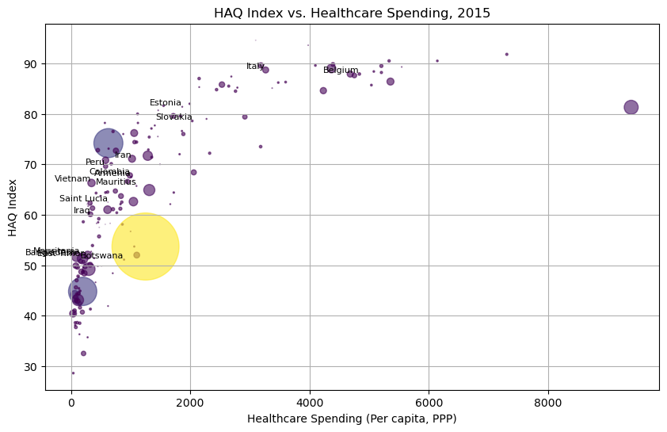

# Healthcare Access and Quality Index vs. Healthcare Spending

## Key User Groups
The key groups the topic is addressing are researchers, policymakers, and global health analysts. 

### Global Health Researchers
Interested researchers can use the data and visualization to identify trends, challenges, and potential areas for improvement in countries with a lower HAQ index and how that connects to their healthcare spending. Additionally, they can identify long-term trends in global health metrics over multiple years and identify long-term trends. The data visualization also emphasizes thematic inquiries, such as analyzing national or regional healthcare system, understanding what makes some countries' healthcare models successful.

### Policymakers
Policymakers can utilize the data to make informed decisions regarding the nation's healthcare spending, resource allocation, and quality improvement. They could analyze how changes in healthcare policies affect health quality indicators. Additionally, policymakers are able to compare their country's healthcare system against global standards to pinpoint areas for improvement. Mainly, they need to undergo regular policy evaluation to assess the effectiveness of implemented policies.

### Healthcare Analysts
One of healthcare analysts' main responsibilties encompass data mining and exploration, which involve extracting insights and trends from databases linked to healthcare spending and quality. They use historical data to develop models anticipating future healthcare trends and insights. Using these insights, they act as consultants for healthcare organizations in making informed, data-driven decisions.
___

## Visualization Types

### Scatter Plots
The scatter plot helps understand the relationship between two continuous variables, in this case HAQ index and healthcare spending. After adding additional features, it can be filtered by specific countries and years to get deeper insight on a more specific dataset. It helps identify patterns, clusters, and outliers.

### Heatmaps
Heatmaps helps analyze the correlation between multiple variables simultaneously as they represent a correlation matrix. Thus, making it easier to identify strong or weak correlations between different healthcare metrics. Additionally, when the map of the world is color coded using a gradient, it's an easier visualization and can help identify regional clusters.

___

## Additional Features

1. **Filtering and Sorting Options**: allows users to focus on specific subsets of data based on their criters. This will help users filter data by region, country, or year.

2. **Animated Time Progression**: allows users to see an animation of the change in a country's HAQ index and healthcare spending over a range of years. This will aid in an easier visual understanding of the trends that changed overtime.

3. **Interative Elements**: provides users with the ability to interact with the visualization. Users can hover over data points to see detailed information and toggle between different views, enhancing their exploratory nature of the analysis.

___

## Prototype

